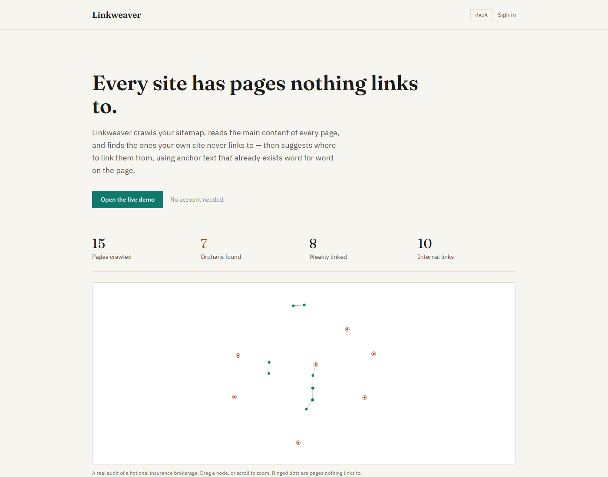
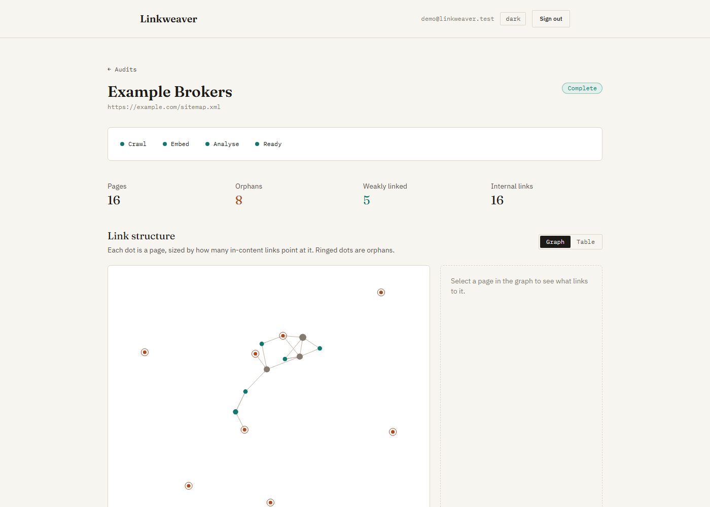
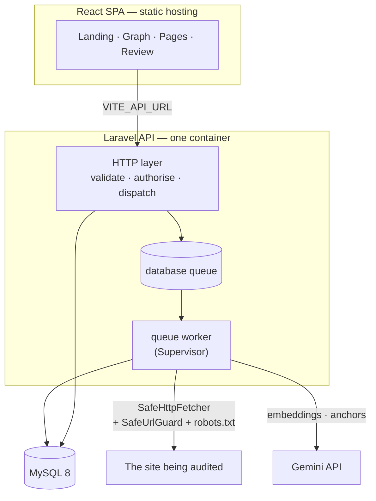
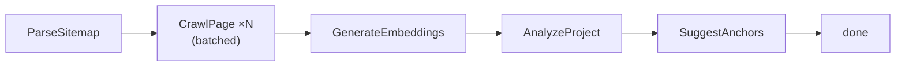
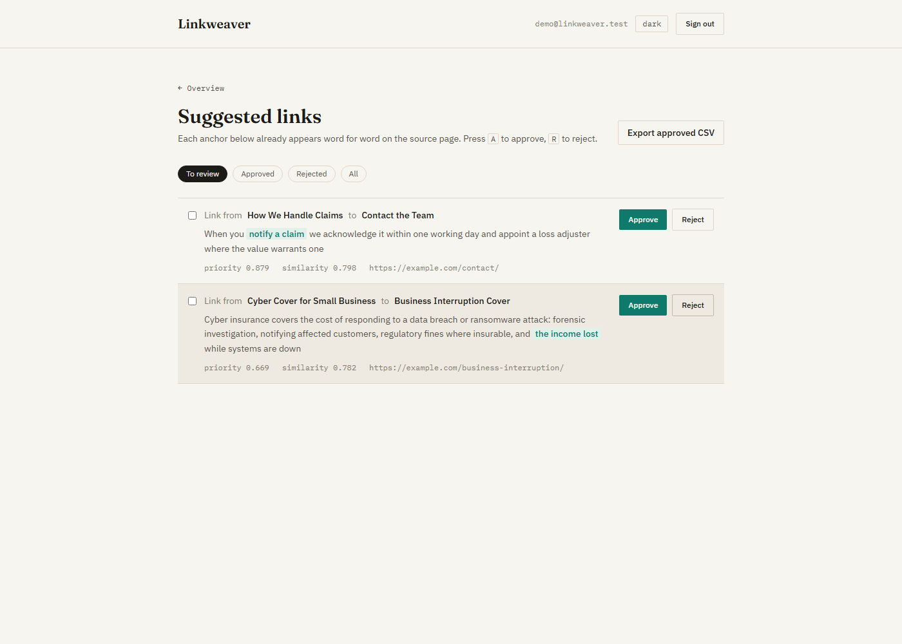

# Linkweaver

**Every site has pages nothing links to.** Linkweaver crawls a sitemap, reads the main
content of every page, and finds the pages the site never links to from within its own
body copy — then uses Gemini embeddings to find topically related pages that *should*
link to them, and asks a text model for anchor text that already exists word for word on
the source page. Every suggestion is validated in code before it is stored, and you
approve or reject each one before exporting a worklist as CSV.

I built it to automate work I used to do by hand for a commercial insurance website:
opening a spreadsheet, reading every page, and trying to remember which ones had nothing
pointing at them.

> **Live demo:** _not yet deployed — see [DEPLOYMENT.md](DEPLOYMENT.md)._
> The demo project is public and needs no account.



---

## The idea that makes it work

Most internal-link tools count every link on a page. That sounds reasonable and is
useless: a footer link appears on all 200 pages of a site, so **every page looks perfectly
well linked and no orphan ever surfaces.**

Linkweaver counts only links written into the body of a page. Navigation, footers,
sidebars and "related posts" widgets are extracted and stored, but never counted. A page
carrying a nav link from all 200 of its siblings is still an orphan — because nobody ever
made an editorial decision to link to it.

Two further rules follow from the same thinking:

- A page cannot rescue itself by linking to itself.
- A link to a URL the sitemap never listed points at nothing we crawled.



## Architecture



The frontend never imports from the backend. It is a static bundle that talks to the API
over HTTP, so it can sit on Cloudflare Pages while the API runs anywhere.

## The pipeline

Every stage is a queued job. The HTTP request that creates a project only validates the
input and dispatches — a slow or enormous site can never hold a web worker open.



| Stage | What it does |
| --- | --- |
| **ParseSitemap** | `<urlset>` and `<sitemapindex>` recursively, gzip, taxonomy archives skipped, capped at `LINKWEAVER_MAX_PAGES` |
| **CrawlPage** | One job per page, throttled per domain, obeying `robots.txt`. Extracts main content and in-content links |
| **GenerateEmbeddings** | Batched, cached by content hash, rate limited |
| **AnalyzeProject** | Cosine similarity over all pairs; candidates scored by similarity **and** how few inbound links the target has |
| **SuggestAnchors** | One text-model call per candidate, then validated hard |

## Key decisions, and why

**URL normalisation is the most important code in the project.**
`UrlNormalizer` gives every URL exactly one spelling — `www` folded to the sitemap's own
form, scheme unified, tracking parameters stripped, one trailing-slash rule, relative
links resolved. A false negative invents an orphan that does not exist; a false positive
silently merges two real pages into one row. It has 52 tests.

**Only in-content links count.** Described above. This is the product.

**SSRF protection is not optional.** The crawler fetches URLs a user supplied and URLs
found in third-party HTML. Without a guard, "audit my sitemap" is a request for the server
to make HTTP calls to anywhere it can reach — cloud metadata endpoints, admin panels on
localhost, databases on a private subnet. `SafeUrlGuard` resolves the host and refuses
private, loopback, link-local and reserved ranges in **every notation** — including
`2130706433`, `0177.0.0.1`, `127.1` and `::ffff:127.0.0.1` — checks every address a name
resolves to rather than the first, and re-validates every redirect hop. 65 tests.

**Model output is untrusted.** A language model asked to quote a phrase from a page will
often paraphrase it. That produces a suggestion nobody can apply, and it is
indistinguishable from a good one until someone tries. `AnchorValidator` requires the
anchor to appear **verbatim** in the source content, within the configured word range, not
inside an existing link, and not inside a heading. Anything else is discarded with a
logged reason. 35 tests.

**Embeddings are cached by content hash.** The key is `(page_id, model, content_hash)`, so
re-running a project spends quota only on pages whose content actually changed, and
switching models re-embeds everything rather than comparing vectors that were never
comparable.

**Rate limiting is enforced where it actually bites.** Laravel's `RateLimited` job
middleware throttles how often a *job* runs, not the requests inside it — fine for
embeddings, which batch 50 per request, but useless for anchors, which cannot batch and
make one call per candidate. The anchor job therefore paces itself between calls.



## Known limits, and how it would scale

- **Similarity is an in-memory O(n²) all-pairs comparison.** Fine for the 200-page cap
  (~20,000 comparisons of 768-element vectors, milliseconds). Past a few thousand pages
  this wants a vector database — pgvector or a managed service — and an approximate
  nearest-neighbour index instead of the full matrix.
- **The queue uses the `database` driver**, chosen so the whole thing runs on free-tier
  hosting with no Redis. The scaling path is Redis plus horizontally scaled workers, which
  is a config change rather than a rewrite: nothing in the jobs assumes a single worker.
- **Anchor generation cannot be batched**, so it costs one request per candidate and is
  capped at `LINKWEAVER_ANCHORS_PER_PROJECT` (100) to stay inside a free quota.
- **IDN hosts are lowercased but not punycode-normalised**, because the dev machine has no
  `intl` extension and CI matches it for parity.
- **Gemini's similarity range is compressed.** On a real 16-page site all 120 page pairs
  scored between 0.60 and 0.87. `similarity_threshold` is a relative cut, not an absolute
  measure of relatedness — measure the distribution on your own content before changing it.

## Running it locally

Requires PHP 8.3+, Composer, Node 22+, and MySQL 8.

```bash
# Backend
cd backend
composer install
cp .env.example .env
php artisan key:generate
# create the databases, then:
php artisan migrate --seed          # includes the demo project
php artisan serve                   # http://localhost:8000
php artisan queue:work              # REQUIRED — the pipeline is queued jobs

# Frontend
cd frontend
npm install
cp .env.example .env
npm run dev                         # http://localhost:5173
```

Gemini is optional. Without `GEMINI_API_KEY` the crawl and link analysis still run to
completion and the app is fully usable — only the embedding and anchor stages are skipped.

Windows users: PHP ships without a CA bundle, so every outbound HTTPS call fails until
`curl.cainfo` is set. See [CLAUDE.md](CLAUDE.md) for the fix.

## Tests

```bash
cd backend  && composer check   # Pint + 499 Pest tests
cd frontend && npm run check    # ESLint + tsc + Prettier
```

**No test touches the real network or the real Gemini API.** Crawls run against
`Http::fake()` and fixture HTML mirroring real WordPress themes (Twenty Twenty-Four,
Astra, GeneratePress, plus one with no semantic wrapper to exercise the readability
fallback). Gemini responses are faked everywhere, and `phpunit.xml` pins `GEMINI_*` to
empty so the suite behaves identically with or without a real key in `.env`.

## Deployment

One container runs nginx, php-fpm and the queue worker under Supervisor — see
[DEPLOYMENT.md](DEPLOYMENT.md) for Oracle Cloud (ARM) and Render, plus Cloudflare Pages or
Netlify for the frontend.

## Stack

Laravel 13 · PHP 8.3 · MySQL 8 · Pest · React 19 · Vite · TypeScript · Tailwind 4 ·
TanStack Query · `react-force-graph-2d` · Symfony DomCrawler · Gemini
